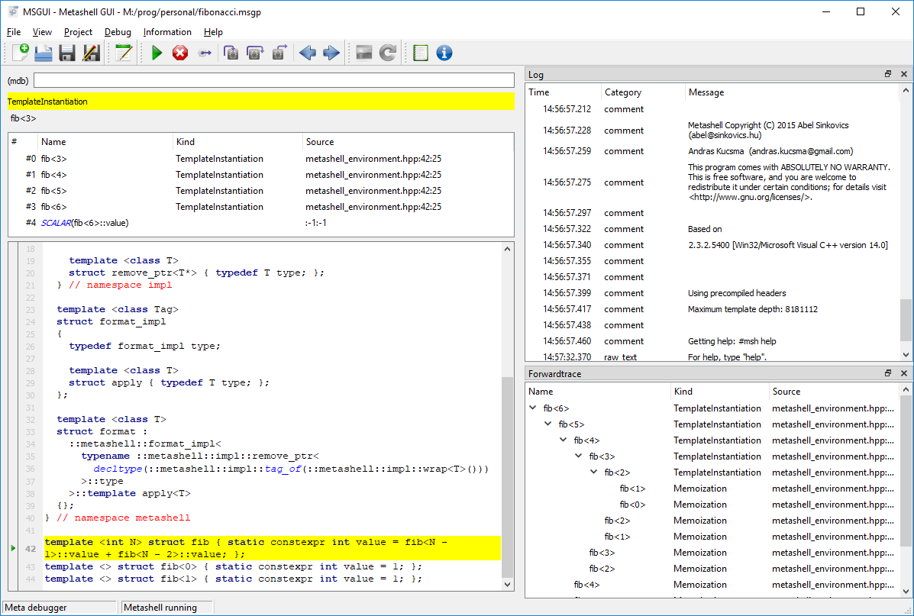

# MSGUI - Metashell GUI

MSGUI is a [metashell](http://metashell.org) GUI frontend.

The goal of metashell is to provide an interactive C++ template metaprogramming shell.

MSGUI provides an IDE that allows stepping into C++ template code, showing back and forward traces, and evaluting template code interactively. It shows the current line on a code editor like a common debugger.

The metashell application must be installed separatelly.

The code is tested on Windows and Ubuntu 16.04.

## Screenshot

### How to debug

Run the application, press F4 to open the project settings, and on the startup code configuration, add the template code you want to test. Alternativelly, add an include path in the process params, and #include <myfile.cpp> on the prompt, or on the startup code setting.

Back at the main window prompt, type the code you want to debug and **PRESS F5** to start the debugger. This will show the first step and build the call stack.

To debug, press F11 for step into, Shift-F11 for step out, and F10 for step over. To see the forward trace, press F7.

The prompt keeps a history of used commands, available pressing the UP and DOWN keys.

The application uses the modes available on metashell, and the prompt accepts all commands that metashell provides, so learning metashell should be a great help to using this program.

### Dependencies

* [MREdit editor](https://github.com/RangelReale/mredit)
* [Log4Qt](https://github.com/MEONMedical/Log4Qt)

### Other code

* Uses history_line_edit from Mattia Basaglia

### License

MIT License

### Author

Rangel Reale (rangelreale@gmail.com).
